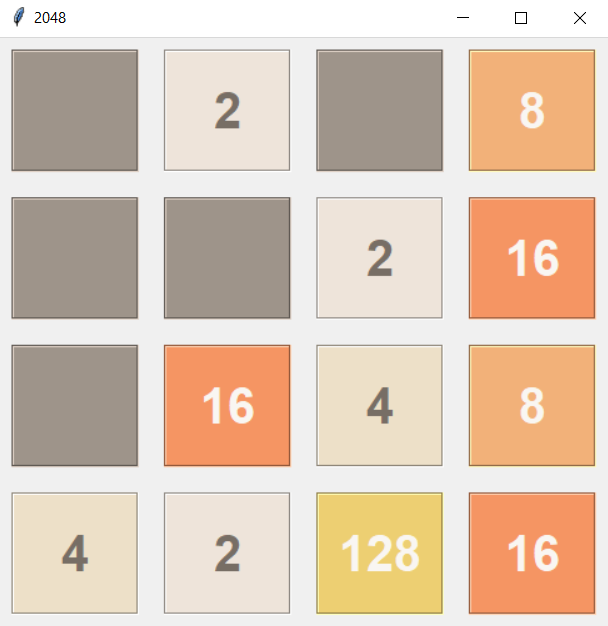
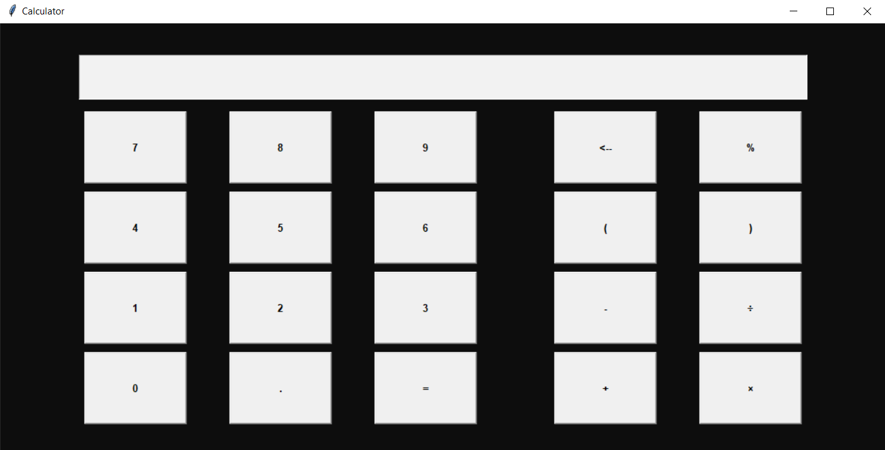

Small python projects

## 2048
inspired by https://github.com/yangshun/2048-python  
It's a solo game by Gabriele Cirulli, released on March 9, 2014.  

  

 

## Cards
Works like a pack of cards  
(inspired by the book by Vincent Le Goff)
 

## Casino
little money game with game save  
(inspired by the book by Vincent Le Goff)
 

## Choice
For when there are difficult choices to make.  
Allows you to keep the same lists of choices each time, to choose between different numbers, ranges of numbers or words.
 

## Hangman
A little hangman game with game save.  
(inspired by the book by Vincent Le Goff)

## Spy
Spy game (the rules are explained at the beginning)  
To play with several friends or family members (need at least 4 people).
 

## calculator
A small calculator with tkinter
 

  

## text_morse
Translate text to morse or vice-vera (morse into latin alphabet).  
Hear morse signals (sound, after translation or directly)
 

## ytb_videoDownloader
To download YouTube videos and its subtitles  
It may be that for some video and subtitle it does not work, if you know why i'd like you to send me a message :)
